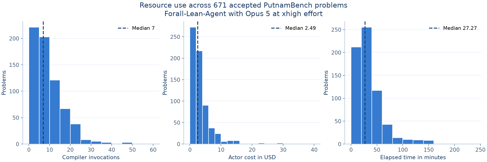

# Forall PutnamBench

[](https://arxiv.org/abs/2610.00885)
[](LICENSE)

Evaluation results for [Forall-Lean-Agent](https://github.com/astrio-labs/forall-lean-agent) on [PutnamBench](https://github.com/trishullab/PutnamBench), released by [Astrio](https://github.com/astrio-labs).

This repository publishes result metadata, environment pins, artifact hashes, and scripts that reproduce the resource summaries. The snapshot contains 672 evaluated problems using Opus 5 at xhigh effort in the answer-given configuration.

The [research source repository](https://github.com/astrio-labs/forall-lean-agent) now provides the PutnamBench actor and reviewer harness, original prompts, verification code, and shared Lean MCP tools under Apache-2.0. It uses a separately installed Claude Code client and a user-provided model account. Its [release notes](https://github.com/astrio-labs/forall-lean-agent/blob/main/docs/release-scope.md) document packaging changes from the historical implementation. Benchmark solution proofs remain private.

| Outcome | Problems |
| --- | --- |
| Accepted by local verification and fresh review | **671** |
| Recorded false statement | 1 |
| Evaluated | 672 |

The non-accepted case is `putnam_1974_b1`. It is recorded separately as `statement_false` and excluded from the accepted-task resource summaries. These outcomes are author-reported evaluation records. The export itself is not an independent benchmark certification.

## Results

- [Per-problem results](results.csv) contain outcomes and resource measurements.
- [Verification metadata](verification.json) records artifact hashes and recorded verdicts.
- [Summary tables](reports/summary.md) report coverage, costs, runtime, and token use.
- [Year-by-year coverage](reports/by_year.csv) provides all 64 years.
- [Environment pins](environment/) identify the benchmark, Lean, and dependency revisions.



Across the 671 accepted task records, the recorded actor and reviewer costs total **$3,153.65**, averaging **$4.70** per accepted problem. These subtotals cover the retained final task records and exclude archived or superseded attempts. The false-statement task is outside these summaries.

The [data dictionary](DATA_DICTIONARY.md) defines the accounting scope, cache-token fields, and missing values.

## Reproduce the summaries

Python 3.10 or newer is sufficient for the numeric reports and package validation.

```sh
git clone https://github.com/astrio-labs/forall-putnambench.git
cd forall-putnambench
python3 scripts/summarize.py
python3 scripts/validate.py
```

To regenerate the figure, use Python 3.11 or newer and install the pinned plotting dependency in a virtual environment.

```sh
python3 -m venv .venv
. .venv/bin/activate
python -m pip install -r requirements.txt
python scripts/summarize.py --plots
python scripts/validate.py
```

These commands reproduce the published analysis from `results.csv`. They do not run model inference or check the privately retained proofs.

## Verification and release scope

Before export, all 671 accepted proof files matched their recorded SHA-256 hashes. Each accepted record had verifier success and a final reviewer approval. All 672 frozen benchmark entries matched the pinned upstream revision. The public validator checks the metadata schema, cross-file consistency, generated reports, and release inventory.

Artifact hashes identify the retained files. A matching hash alone does not establish proof correctness, and the public metadata does not let a reader independently rerun the proof checks.

Solution proofs, refutations, intermediate proof steps, transcripts, and compiler diagnostics are withheld in accordance with [PutnamBench's request to avoid public proof releases](https://github.com/trishullab/PutnamBench#readme). Verification evidence can be shared privately through the benchmark maintainers' process.

## Citation and license

If you use these results or Forall-Lean-Agent, please cite the [FORALL paper](https://arxiv.org/abs/2610.00885):

```bibtex
@misc{lwin2026forallleanagentauditablereasoningformal,
  title={FORALL-LEAN-AGENT for Auditable Reasoning in Formal Mathematics and Software Verification},
  author={Naing Oo Lwin},
  year={2026},
  eprint={2610.00885},
  archivePrefix={arXiv},
  primaryClass={cs.SE},
  doi={10.48550/arXiv.2610.00885},
  url={https://arxiv.org/abs/2610.00885}
}
```

Please cite [PutnamBench](https://arxiv.org/abs/2407.11214) when using the benchmark. Repository citation metadata is provided in [CITATION.cff](CITATION.cff).

This metadata and analysis release uses the [Apache License 2.0](LICENSE). See [NOTICE](NOTICE) for attribution.
